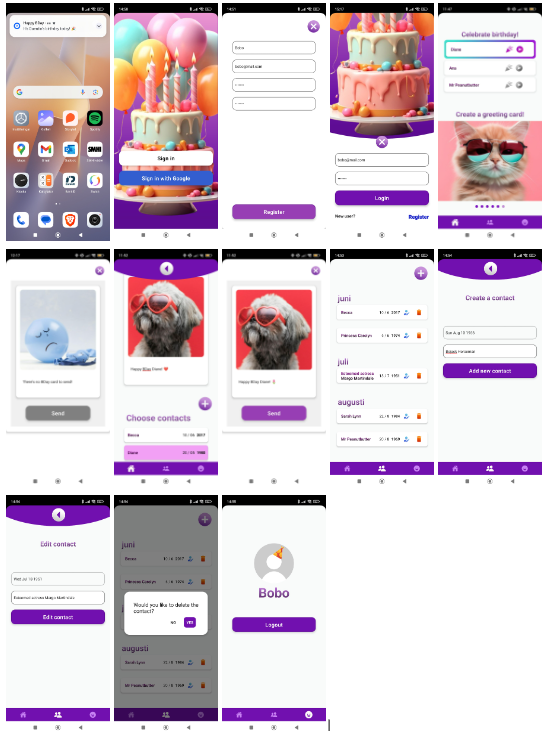

## BEHOLD! My Android app, written in React Native Expo with TypeScript for my final project in the System Development .NET program.

Happy BDay is your birthday assistant in your pocket! Create your contacts and personal birthday messages, and with a reminder notification, you'll never be a lousy friend who forgets that one birthday, or two, or three...

Many social apps have birthday reminders, but they also come with so much else that can eat up all your free time, or work time! HEY! I'm not judging anyone here!

## How to Install the App:

Don't forget to also download the API, happy-bday-api, for all data fetching!
Run the command npm install to install all dependencies.
Start the app with the command npm start.
You can use it on the Android Simulator on your computer or a reliable Android phone with the Expo Go app!

